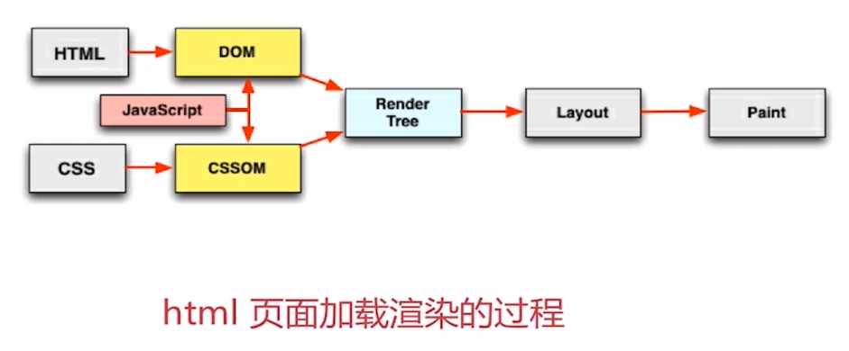

# 4
- 理解浏览器端 html、css、js 的加载过程
- 结合 chrome 的能力学习掌握 css、js 加载过程中的优化点

html页面加载渲染的过程如下图

## html
html渲染过程中可优化的切入点
- 顺序执行、并发加载、并发上限
- 是否阻塞
- 依赖关系
- 引入方式

## 阻塞
### css阻塞
css在header中加载，阻塞页面的渲染。 
css放在header里加载，会在加载完后转换成cssom树，并与dom树合并，再进行接下来的渲染过程。这期间会阻塞页面的渲染。
 
之所以考虑把css放到header里，是希望不出现样式未加载完，但是页面已经渲染完的显示问题。

css加载不阻塞外部js的加载，但阻塞js的执行。
 
原因是js中可能会有操作的css的代码。
### js阻塞
直接引入js，阻塞页面的渲染。原因是js中可能会有操作的dom的代码。
 
js不阻塞资源的加载
 
js顺序执行，阻塞后续js逻辑的执行